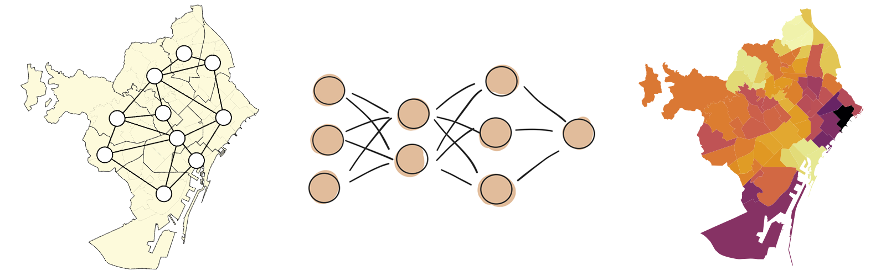
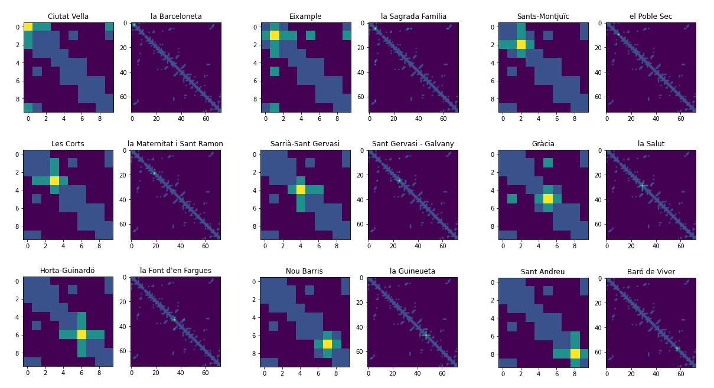
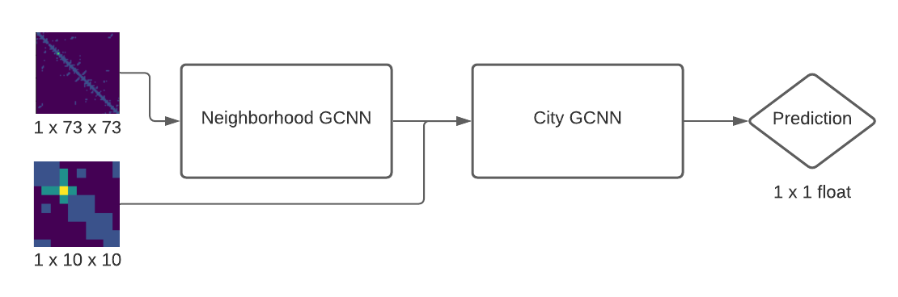
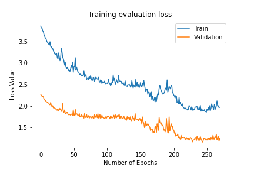
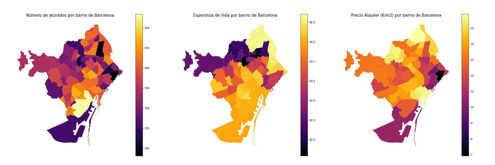

# World Data Viz Challange 2020

## Graph Convolutional Neural Network for spatio-contextual predictions

This repository contains the Pytorch implementation and Jupyter Notebooks of the presented project in the __World Data Viz Challange 2020__ for the city of Barcelona.

For the __URL to the visualization__, see the Jupyter Notebook `notebook.ipynb`.

<p align="center">
    
</p>

## Contents
1. [Introduction](#introduction)
0. [Model Proposed](#problems-with-prior-work)
0. [Training](#training)
0. [Evaluation](#evaluation)
0. [Tutorial](#tutorial)
0. [Acknowledgements](#acknowledgements)

## Introduction
The project develops an Artificial Intelligence architecture based on a Convolutional Neural Network that, through the city's topological information (connection between districts / neighborhoods), is able of predict different data associated with it. A correct prediction using only spatial information will not only provide a good estimate of this value, but also a clear relationship between it and its location within the city.

MUY BIEN PARA TIPO TERRITORIO


### Understanding the city as a graph
The project consists of the development of a Convolutional Neural Network where the input data are based on topological graphs of the city of Barcelona. The network uses two graphs: the district graph and the neighborhood graph, both in the form of an adjacency matrix. This matrix indicates the connection relationship between the nodes (district / neighborhood) of a graph. The proposed matrix is ​​not only based on the connection between nodes, but specific weights are applied to each evaluated node, which add more importance to its direct neighbors, thus providing spatial-contextual information on the city.
<p align="center">
    
</p>


## Model proposed
The model consists on two different CNN that take as input two different graphs of the city. The first network takes as input the neighborhood graph and outputs 16 differents maps of features trained to differentiate between neighborhoods.

At the output of the network, the district map is concatenated adding district spatial information to the city Grap Convolutional Neural network that will then predict the output value.
<p align="center">
    
</p>

The details of the model presented are present in `model.py` and a summary of the model is detailed in the table below:


| Layer  | Size-in      | Size-out      | Kernel |
|--------|--------------|---------------|--------|
| conv_1 | 1 x 73 x 73  | 8 x 69 x 69   | 5      |
| pool_1 | 8 x 69 x 69  | 8 x 23 x 23   | 3      |
| conv_2 | 8 x 23 x 23  | 16 x 23 x 23  | 3      |
| pool_2 | 16 x 21 x 21 | 16 x 10 x 10  | 2      |
| concat | 16 x 10 x 10 | 17 x 10 x 10  | -      |
| conv1  | 17 x 10 x 10 | 32 x 6 x 6    | 5      |
| conv2  | 32 x 6 x 6   | 64 x 4 x 4    | 3      |
| conv3  | 64 x 4 x 4   | 64 x 4 x 4    | 1      |
| fc1    | 64 x 4 x 4   | 1 x 128       | -      |
| fc2    | 1 x 128      | 1 x 64        | -      |
| fc3    | 1 x 64       | 1 x 1         | -      |


## Training
The training procedure is detailed in the script `train.py`. Our model is trained with __Mean Squared Error loss (MSE)__ as we are dealing with a regression problem of predicting a unique value. The optimizer used is __ADAM__ but further research can be done for the choice of the optimizer that better suits this problem.

The __training__ set is aproximately 70% of the loaded data and the other 30% is used as a __validation__ dataset to avoid overfitting the data. The training process (loss evolution) can be seen in the Jupyter Notebook implementation and will plot both the training and evaluation loss.

A sample loss evolution trained on one of the possible datasets will look like the figure below:

<p align="center">
    
</p>


## Dataset evaluation
The results of this architecture are surprising. Not only is the network capable of predicting values ​​such as the evolution of the rate of aturados by months, rental value (m2 and monthly), average size of home per area ... but it is able to relate these to the topology of the problem, producing a homogeneous map, with natural transitions between neighborhoods and districts.

Below you'll find this architecture trained for 3 different problems (see `datasets.py` for more datasets) and the resulting heat map generated: (Titles in spanish)

<p align="center">
    
</p>

## Tutorial
The implementation of this project can be found in the Jupyter Notebook `notebook.ipynb`. All the parameters are detailed in the explanation of each section.

To run the attached notebook, make sure your Python environment has installed all the packaged required in the `requiriments.txt` file. To do so run the following command (`pip`):

```shell
pip install -r requiriments.txt
```

or alternatively in `Conda` environment:

```shell
conda install --file requirements.txt
```

## Acknowledgements

__Tobias Skovgaard Jepsen__: Explanation to understand the implementation of Graph Neural Networks:
> https://towardsdatascience.com/how-to-do-deep-learning-on-graphs-with-graph-convolutional-networks-7d2250723780

__Marta Gonzalez__: GeoJSON files for the generation of the Barcelona map:
> https://github.com/martgnz/bcn-geodata

__Raúl Estevez__: Easy step-by-step tutorial for generating maps given a GeoJSON file:
> http://www.geomapik.com/desarrollo-programacion-gis/mapas-con-python-geopandas-matplotlib/

